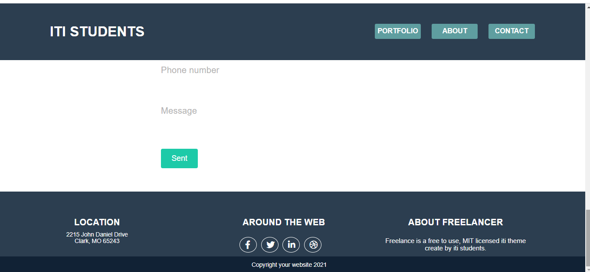

# Movies Website

<b>The website contain landing page that displays sections with fixed navbar</b>
    
    - Portfolio
    - About
    - Contact

  

 

- <b>portfolio section</b>
    
  

  

  

  

  

- <b>About section</b>

  

  

- <b>then Contact section with validation</b>

 
 

  

  

- <b>Footer</b>

 
 

  

 

 

- <b>finally your welcome to our cv template</b>
